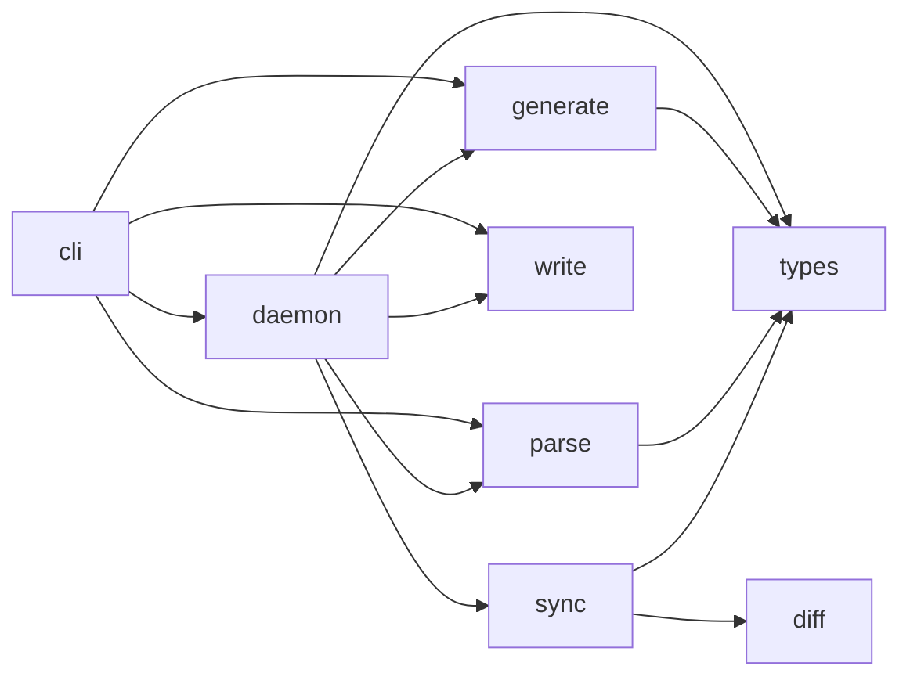

```mermaid
graph LR
  cli --> daemon
  cli --> parse
  cli --> generate
  cli --> write
  daemon --> parse
  daemon --> generate
  daemon --> write
  daemon --> sync
  daemon --> types
  generate --> types
  parse --> types
  sync --> types
  sync --> diff
```
